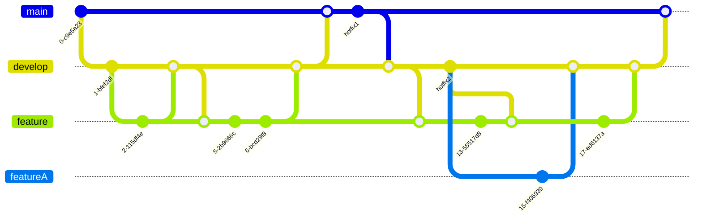

# Git Flow of gnss_fs

```mermaid
gitGraph
  commit

  branch develop
  commit
  branch feature
  commit
  checkout develop
  merge feature

  checkout feature
  merge develop
  commit
  commit
  checkout develop
  merge feature
  checkout main
  merge develop

  commit id: "hotfix1"
  checkout develop
  merge main
  checkout feature
  merge develop
  checkout develop
  commit id: "hotfix2"
  checkout feature
  commit
  merge develop
  checkout develop
    branch featureA
    commit
    checkout develop
    merge featureA
  checkout feature
  commit
  checkout develop
  merge feature
  checkout main
  merge develop
```
