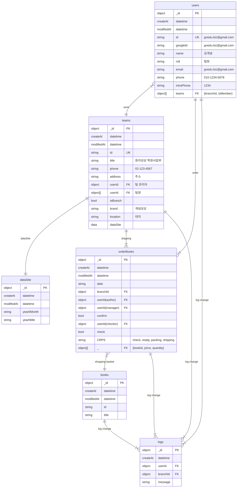

# MongoDB Model of gnss_fs

```mermaid
erDiagram
  users {
    object _id PK
    createAt datetime
    modifiedAt datetime

    string id UK "gnedu.biz@gmail.com"
    string googleId "gnedu.biz@gmail.com"
    string name "김개념"
    string roll "팀장"
    string email "gnedu.biz@gmail.com"
    string phone "010-1234-5678"
    string intraPhone "1234"
    object[] teams FK "{branchId, isMember}"

  }

  teams {
    object _id PK
    createAt datetime
    modifiedAt datetime

    string id UK
    string title "원리상상 학원사업부"
    string phone "02-123-4567"
    string address "주소"
    object userId FK "팀 관리자"
    object[] userId FK "팀원"

    bool isBranch
    string brand "개념상상"
    string location "대치"
    data dataSite
  }
  dataSite {
    object _id PK
    createAt datetime
    modifiedAt datetime

    string year0Month
    string year0title
  }

  orderBooks {
    object _id PK
    createAt datetime
    modifiedAt datetime

    string date
    object branchId FK
    object userId(author) FK
    object userId(manager) FK
    bool confirm
    object userId(checker) FK
    bool check
    string CRPS "check, ready, packing, shipping"
    object[] _ FK "{bookId, price, quantity}"
  }

  books {
    object _id PK
    createAt datetime
    modifiedAt datetime

    string id
    string title
  }

  logs {
    object _id PK
    createAt datetime

    object userId FK
    object branchId FK
    string message
  }

  users }|--|| teams: work
  teams ||--|| dataSite: dataSite
  users ||--|{ orderBooks: order
  teams ||--|{ orderBooks: shipping
  orderBooks }|--|| books: "shopping basket"

  users ||--|{ logs: "log change"
  teams ||--|{ logs: "log change"
  orderBooks ||--|{ logs: "log change"
  books ||--|{ logs: "log change"


```
