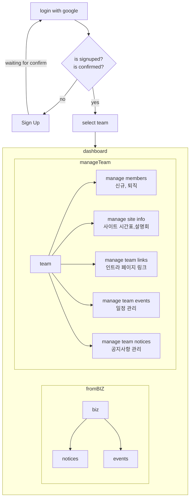

```mermaid
flowchart TD
  login[login with google] --> isSignuped{is signuped?\nis confirmed?}
  isSignuped -->|no| signup[Sign Up]
  signup -->|waiting for confirm| login
  isSignuped -->|yes| selectTeam[select team]

  subgraph dashboard
    subgraph fromBIZ
      biz --> notices
      biz --> events
    end
    subgraph manageTeam
      direction LR
      team --> member[manage members\n신규, 퇴직]
      team --> site[manage site info\n사이트 시간표,설명회]
      team --> link[manage team links\n인트라 페이지 링크]
      team --> event[manage team events\n일정 관리]
      team --> notice[manage team notices\n공지사항 관리]
    end
  end
  selectTeam --> dashboard


```
